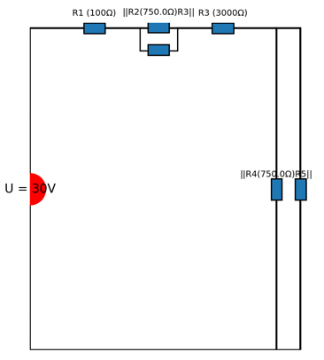

# Schaltung


## Beschreibung:

Das Programm erstellt eine Elektrische Schaltung bestehen aus beliebig vielen Widerständen und einer Spannungsquelle. Des Weiteren werden die Spannungen und Ströme an den einzelnen Widerständen sowie der Gesamtwiderstand berechnet. Die Schaltung wird dabei in einem Plot Fenster visuell dargestellt. 


## Installation:

Um mit diesem Projekt zu arbeiten, folge diesen einfachen Schritten:

1. Klicke auf GitHub auf "Download ZIP", um das Projekt herunterzuladen.
2. Entpacke das ZIP-Archiv in einem Verzeichnis deiner Wahl.
3. Öffne eine Konsole oder ein Terminal und navigiere zu dem Verzeichnis, in das du das Projekt entpackt hast.
4. Installiere die notwendigen Python-Pakete mit:

```
pip install -r requirements.txt
```

## Voraussetzungen:

- Python 3.8 oder höher
- Matplotlib für die Visualisierung (Installationsbefehl: `pip install matplotlib`)
- Pytest für die Unittests `pip install pytest`

## Ziel und Umsetzung des Projektes:

Ziel des Projektes ist es die Möglichkeit zu besitzen eine Schaltung aus Widerständen zu erstellen und alle wichtigen Ströme und Spannungen in der Schaltung zu berechnen. Das Projekt soll die Schaltung visuell darstellen und die Ergebnisse in der Konsole ausgeben.

Zur Umsetzung wurden folgende Klassen mit ihren jeweiligen Methoden erstellt:

 - **Resistor:** Erstellt ein Objekt des Widerstandes und kann den Ohm Wert des Objektes wiedergeben und in der Konsole plotten
 
 - **VoltageSource**:  Erstellt ein Objekt der Spannungsquelle und kann den Volt Wert des Objektes wiedergeben. Außerdem können die Spannungen mit der Spannungsteiler-Regel berechnet werden
 
 - **PowerSource:** Erstellt ein Objekt der Stromquelle und kann den Ampere Wert des Objektes wiedergeben.
 
 - **Series:** : Erstellt eine Reihenschaltung der Widerstände und berechnet den Gesamtwiderstand
 - **Parallel:**  Erstellt eine Parallelschaltung der Widerstände und berechnet den Gesamtwiderstand
 
 - **ElectricalParameters:** Berechnet die Spannung, den Strom oder den Widerstand, je nachdem was gegeben ist. Dienst als Umsetzung des Ohmschen Gesetzes 
 
 - **CircuitVisualizer:** Erstellt eine visuelle Darstellung der Schaltung
 
 - **Print:** Gibt die Ergebnisse der Spannungs- und Stromberechnung in der Konsole aus


## Verwendung:

Zur Erstellung der Schaltung werden zu Beginn die Widerstände 
und die Spannungsquelle als Objekte erstellt. 
Hierfür dient die Klasse ***Resistor*** sowie ***VoltageSource***. 
Diese beiden Klassen erstellen ein Objekt eines Widerstandes bzw. 
einer Spannungsquelle mit dem gewünschten Ohm bzw. Volt Wert.
```
resistor1 = Resistor(100)
resistor2 = Resistor(1000)
resistor3 = Resistor(3000)
```
Anschließend wird angegeben wie die Widerstände in der Schaltung angeordnet sind. Dazu gibt man an welche Widerstände in Reihe oder parallel zueinander angeordnet sind.  Hierzu nutz man die Klasse ***Parallel*** und ***Series***. In diesen Klassen wird der Gesamtwiderstand berechnet je nachdem ob zwei Widerstände in Reihe oder Parallel zueinander geschaltet sind. Im Falle einer Reihenschaltung werden die Widerstandswerte addiert und im Falle einer Parallelschaltung werden die Kehrwerte der Widerstände addiert und davon nochmal der Kehrwert gebildet. 
```
r_parallel = Parallel(resistor2, resistor3)
r_serie = Series(resistor1, r_parallel)
```
Zur Berechnung der Spannungen und Ströme werden die zuvor erstellten Widerstände den jeweiligen Methoden übergeben. In der Klasse ***ElectricalParameters*** befinden sich die Methoden zur Berechnung der Spannungen und Ströme sowie die Berechnung des Widerstandes, sollte die Spannung und der Strom bereits bekannt sein. Zur Berechnung wird eine Objekt der Klasse ***ElectricalParameters*** erstellt, indem man die Widerstände und die gegeben Spannungen bzw. Ströme übergibt. Anschließend kann die jeweilige Methode genutzt werden die für die gewünschte Berechnung (also Spannung oder Strom) benötigt wird. Für den Fall, dass bei einer Schaltung die Spannungsteiler-Regeln gilt, befindet sich in der Klasse ***VoltageSource*** eine Methode, die die Spannungen an den einzelnen Widerständen direkt mithilfe der Spannungsteiler-Regeln berechnet. 

```
u_0 = VoltageSource(30)
u_res = u_0.calculate_u(resistor1, r_parallel)
u_1, u_2 = u_res[0], u_res[1]
u_3 = u_2
```


Zur Visualisierung der Schaltung in einem Plot Fenster dient die Klasse 
***CircuitVisualizer***. Beim Aufruf dieser Klasse müssen die Objekte der Widerstände und der Spannungsquelle angegeben werden. Es öffnet sich dann beim Ausführen des gesamten Codes ein Fenster welche die Schaltung darstellt. 
```
Main.visualize_circuit(u_0, [resistor1, r_parallel, resistor3, r_parallel])
```

Das Programm bietet außerdem die Möglichkeit alle Ergebnisse in der Konsole auszugeben. Hierfür kann die ***Print*** Klasse sowie die ***print-Methode*** in ***Resistor***  verwendet werden. Dazu gibt man einen prefix und die Objekte ein, dessen Ergebnisse in der Konsole ausgegeben werden sollen.


## Beispiel:

Hier folgt ein Beispiel wie die Schaltung in der Main gebaut werden kann:
```
class Main:

    def run(self):
        # First circuit
        resistor1 = Resistor(500)
        resistor2 = Resistor(1000)
        resistor3 = Resistor(3000)

        r_parallel = Parallel(resistor2, resistor3)
        r_serie = Series(resistor1, r_parallel)

        Resistor.print("Erste Schaltung", resistor1, resistor2, resistor3, r_parallel, r_serie)

        u_0 = VoltageSource(30)
        u_res = u_0.calculate_u(resistor1, r_parallel)
        u_1, u_2 = u_res[0], u_res[1]
        u_3 = u_2

        Print.print_voltages("Erste Schaltung", U0=u_0, U1=u_1, U2=u_2, U3=u_3)

        currents_erste_schaltung = ElectricalParameters.calculate_currents([resistor1, resistor2, resistor3], [u_1, u_2, u_3])
        Print.print_currents("Erste Schaltung", **currents_erste_schaltung)

        # Visualization
        Main.visualize_circuit(u_0, [resistor1, r_parallel, resistor3, r_parallel])

    @staticmethod
    def visualize_circuit(voltage_source, resistors):
        visualizer = CircuitVisualizer()
        visualizer.setup_circuit(voltage_source, resistors)
        visualizer.draw()


if __name__ == '__main__':
    main = Main()
    main.run()
```
#### Beispiel für die Visualisierung einer Schaltung:


## Hinweise:

In der Schaltung ist es nicht möglich negative Widerstände zu erstellen. Sobald bei der Erstellung des Objektes eines Widerstands ein negativer Wert angegeben wird, folgt in der Konsole ein Error. Eine Fehlermeldung weist darauf hin, dass der Widerstand nicht negativ sein darf. 
Ein Widerstand mit dem Wert null dagegen ist erlaubt und die Berechnung wird normal durchgeführt. 
